# Semesterdokumentation (Gruppe A)

**Projekt:** *Moosburg Transparent / Rat erklärt* (Civic-Tech-Prototyp)

**Team:** Nicholas Iliou, Moritz Finkel, Jonas Groh

**Was diese Doku leisten soll (laut Aufgabenstellung):** Unser Weg durch alle Phasen, sichtbar durch Artefakte/Bilder, plus klare Learnings und Verbesserungspotenziale.

---

## 0. Kurzüberblick (1 Minute lesen)

### Kern-Nutzerproblem (in einem Satz)
Als Bürger:in von Moosburg möchte ich schnell verstehen, **was entschieden wurde, warum, und was es für meinen Stadtteil bedeutet** – scheitere aber an **verstreuten, verspäteten und schwer verständlichen Informationen**.

### Unser Ansatz (in einem Satz)
Wir bauen eine mobile, leicht verständliche Plattform, die Ratsanträge **auffindbar**, **verständlich** und **vergleichbar** macht – inklusive optionaler Bürgerbeteiligung.

### Was wir am Ende hatten
- Einen lauffähigen Prototyp (Next.js) mit Antragsübersicht, Detailseiten, Filtern, Abstimmungsvisualisierung, Bürger-Voting und Kartenansicht.
- Usability-Testing (SUS + Aufgaben) mit sehr guter Basis-Usability (SUS ~85), aber klaren Hebeln zur Verbesserung.

**Link zum Prototyp (wie in den Abgaben referenziert):** `mvpservicedesign.moo-finkel.workers.dev`

---

## 1. Problem: Was ist relevant – und wo scheitert es konkret?

### Beobachteter Bruchmoment (unser „Aha“)
Im bestehenden Moosburger Portal sind Sitzungsinfos zwar grundsätzlich vorhanden, aber:
- **zu spät** bzw. nicht verlässlich aktuell (Beispiel: Niederschriften teils Monate alt),
- **nicht intuitiv** auffindbar (für Protokolle sind Seitenwechsel/Strukturwissen nötig),
- **zu formal** formuliert (Amtssprache statt „Worum geht’s in 20 Sekunden?“).

### Priorisierte Pain Points (aus Beobachtung + Artefakten)

| Priorität | Pain Point | Woran merkt man’s? | Warum ist das ein Problem? |
|---:|---|---|---|
| #1 | **Verständlichkeit** | Texte/Protokolle sind formal, ohne TL;DR | Bürger:innen steigen aus, bevor Verständnis entsteht |
| #2 | **Auffindbarkeit** | Inhalte sind verteilt, Navigation ist nicht auf „Antrag finden“ optimiert | Bürger:innen geben auf oder finden falsche Infos |
| #3 | **Aktualität** | Veröffentlichungen sind nicht zeitnah | Relevanz sinkt, Vertrauen leidet |

---

## 2. Research: Wie sind wir vorgegangen?

### Methoden (und warum)
- **Desk Research / Portal-Analyse:** um den Status quo der Informationsarchitektur zu verstehen.
- **Teilnahme an Stadtratssitzung (29.10.2025):** um Prozesslogik und Constraints zu lernen (z. B. namentliche Abstimmungen nur auf Antrag).
- **Stakeholder Mapping + Journey-Artefakte:** um sichtbar zu machen, für wen wir optimieren und wo die Reibung entsteht.

**Abbildung 1: Stakeholder Map**

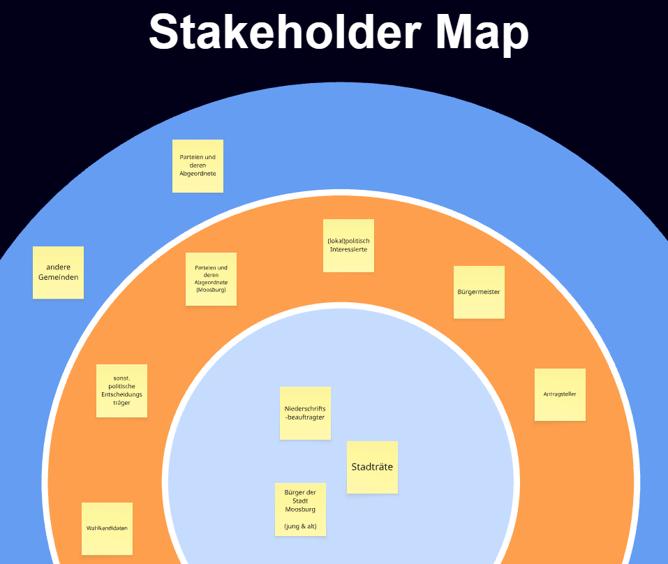

**Abbildung 2: Personas (Arbeitsannahmen)**

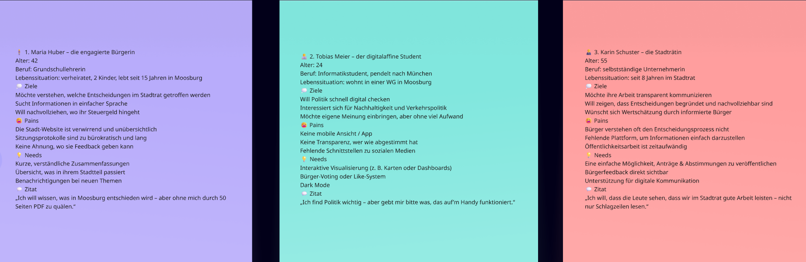

**Abbildung 3: User Insights (aus Beobachtung abgeleitet)**

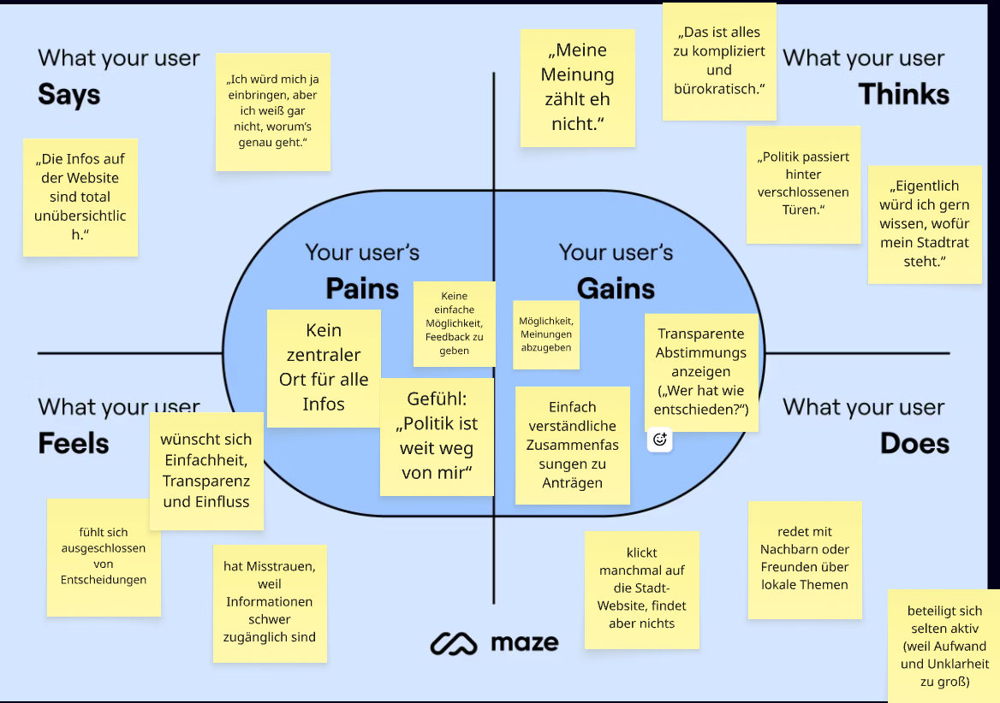

**Abbildung 4: Ist-/Soll-Journey (Was heute passiert vs. was wir ermöglichen wollen)**

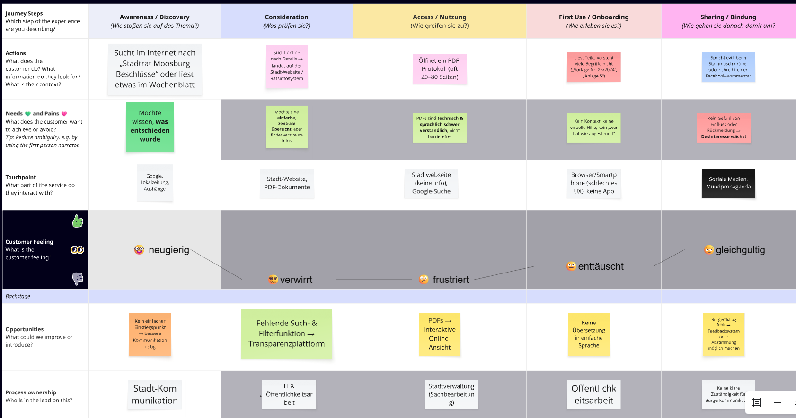

---

## 3. Synthese: Welche Muster sind wirklich entstanden?

Hier haben wir bewusst „Artefakte zeigen“ → „Erkenntnis formulieren“ getrennt.

### Muster / Erkenntnisse (die unser Konzept geprägt haben)
1. **Bürger:innen wollen zuerst Bedeutung, nicht Details.**
    - Erst „Worum geht’s?“ → dann „Details/Protokoll“.
2. **„Finden“ ist der Engpass vor „Verstehen“.**
    - Wenn der Antrag nicht schnell auffindbar ist, ist Verständlichkeit egal.
3. **Lokaler Bezug erhöht Relevanz.**
    - Stadtteil/Ort wirkt wie ein mentaler Filter („betrifft mich das?“).
4. **Transparenz braucht Verifikation.**
    - Wunsch nach Originalunterlagen/Quelle ist ein Trust-Feature.

**Abbildung 5: User Journey Wheel (Clustering von Needs/Pains/Gains)**

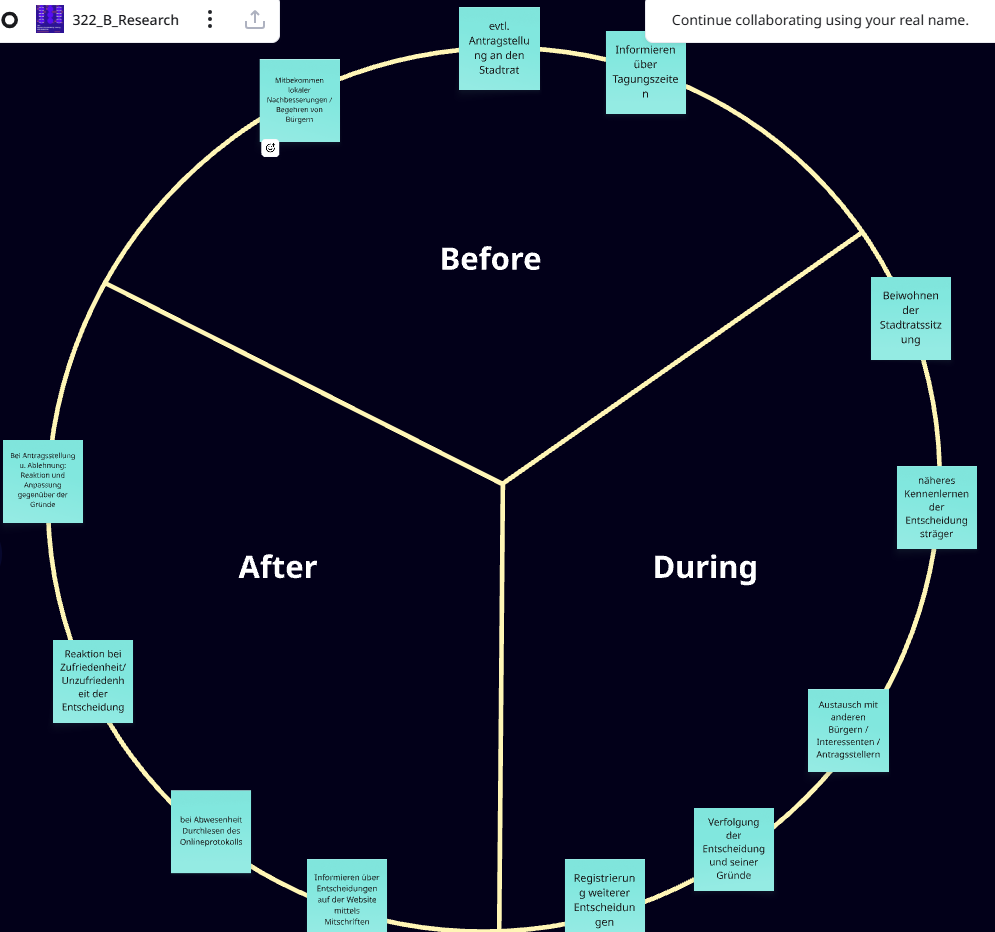

---

## 4. Ideation: Welche Ideen – und warum genau dieses Konzept?

### Divergente Phase (Ideen erzeugen)
Wir haben u. a. **morphologische Matrix** und **Reizwortanalyse** eingesetzt und ~28 Ideen gesammelt.

**Abbildung 6: Ideensammlung (28 Ideen)**

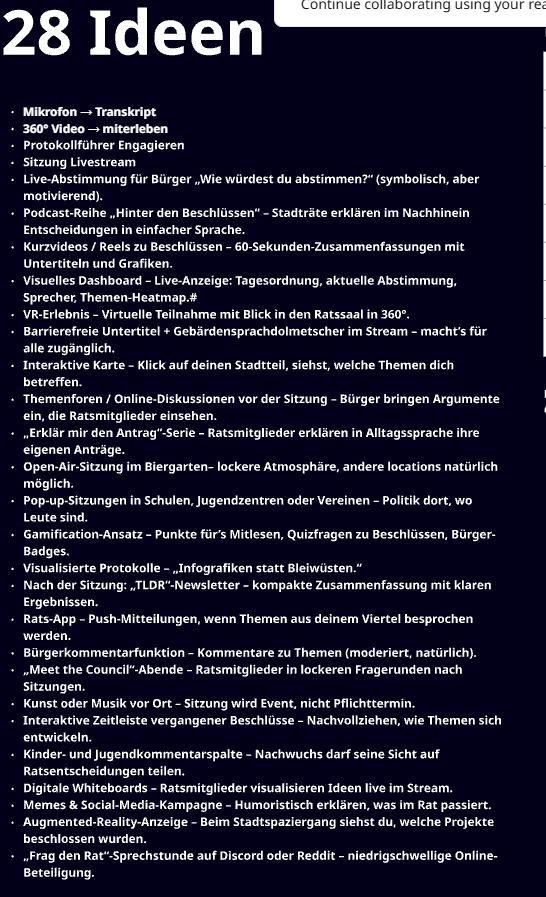

### Entscheidungskriterien (das hat die Auswahl bestimmt)
Wir haben die Ideen anhand dieser Kriterien sortiert:
1. **Hebel auf Pain Points #1–#3** (Verständlichkeit/Auffindbarkeit/Aktualität)
2. **Umsetzbarkeit im Semester (MVP)** (Zeit, Datenzugang, Komplexität)
3. **Recht/Datenschutz-Risiko** (insbesondere bei Audio/Transkription)
4. **Testbarkeit** (kann man es in Aufgaben testen?)
5. **Wartbarkeit** (kann eine Kommune das langfristig betreiben?)

### Kill-Moment (was wir verworfen haben – und warum)
Unser frühes „Mikrofon → KI-Transkript → Protokoll“-Konzept war attraktiv für Aktualität, aber in der Semesterrealität riskant:
- rechtliche/organisatorische Hürden (Zustimmungen, Protokollvorgaben, Datenschutz),
- hoher Integrationsaufwand.

**Konsequenz:** Wir haben das Thema Aktualität nicht ignoriert, aber als **Service-Option** im Konzept gelassen und den MVP-Fokus auf **Verstehen + Finden + Vertrauen** gelegt.

**Abbildung 7: Concept Canvas (frühe Richtung)**

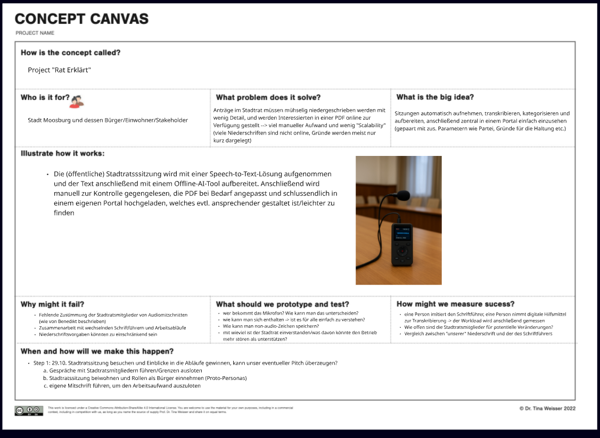

**Abbildung 8: How-Might-We-Fragen (als Brücke von Research → Lösung)**

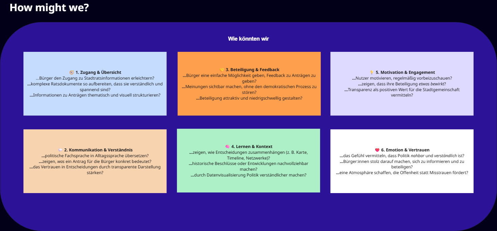

---

## 5. Konzept: Was ist „Rat erklärt“ konkret?

### Das Service-Konzept in 3 Bausteinen
1. **Erklären (Verständlichkeit):** Kurzfassung + strukturierte Detailansicht („Was bedeutet das konkret?“)
2. **Navigieren (Auffindbarkeit):** Suche/Filter + klare Kategorien + Stadtteilbezug
3. **Vertrauen (Transparenz):** Abstimmungsergebnisse visualisieren + optional: Link zu Originalunterlagen

**Abbildung 9: Aktivitäts-/Prozesssicht (wie Nutzer:innen durch den Service laufen)**

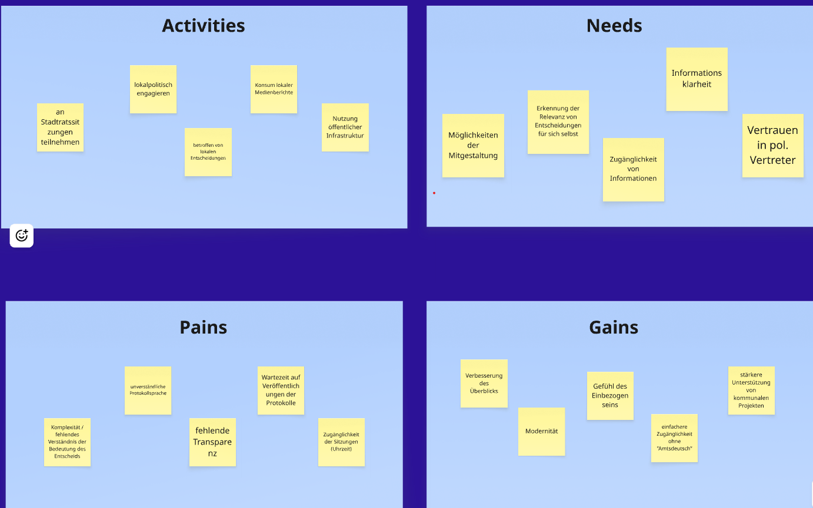

---

## 6. Prototypen: Welche Stufen – mit welchen Lernzielen?

### Lo‑Fi (Ziel: Struktur testen, bevor UI perfektioniert wird)
**Lo‑Fi-Lernziele:**
- Finden Nutzer:innen den richtigen Einstieg?
- Funktionieren Kategorien/Filter mental?
- Ist die „Kurzfassung zuerst“-Logik verständlich?

Artefakte: Journey- und Strukturmodelle (Abbildungen 4–6) sowie erste Struktur-/Konzeptvisualisierungen.

### Mid‑Fi / Click‑Dummy (Ziel: echte Interaktion testbar machen)
Wir sind bewusst relativ früh in einen lauffähigen Click-Dummy gegangen, weil Filter/Navigation und Detailseiten **nur in Interaktion** sinnvoll testbar waren.

**Mid‑Fi-Lernziele:**
- Task Success bei „Tempo 30 finden“
- Qualität der Informationsaufbereitung auf Detailseiten
- Verständnis und Auffindbarkeit von Bürger-Voting
- Mehrwert der Kartenansicht

**Abbildung 10: Visit Flow / Nutzungskontext**

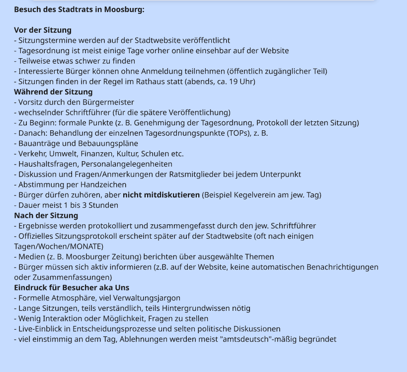

**Abbildung 11: Online Journey (Fokus auf digitale Schritte)**

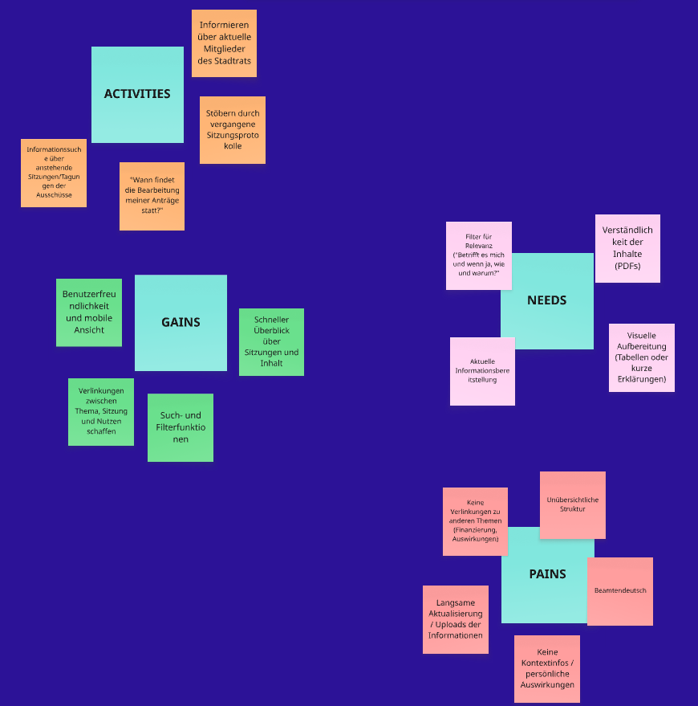

---

## 7. Testing: Vorgehen, Beobachtungen, Learnings

### Setup
- **Remote, unmoderiert** (realistischer Nutzungskontext, weniger „Testleiter-Effekt“)
- **Methodenmix:** SUS + Aufgabenanalyse (7 Tasks)

### Was wir gemessen/gesammelt haben
- SUS-Score (0–100)
- Offenes Feedback pro Aufgabe
- Feature-Wünsche

### Ergebnisse (kurz)
- **SUS ≈ 85 (Exzellent)**
- Kernaufgaben (Antrag finden, Filter nutzen, Details verstehen) funktionieren für die Testgruppe gut.

### Die unbequemen Learnings (das ist der Teil, der uns wirklich weitergebracht hat)
1. **Unsere Kartenannahme war zu optimistisch.**
    - Mehrere Personen sehen „wenig Mehrwert“ bzw. empfinden die Karte als „leer“.
    - Das ist kein UI-Bug, sondern ein Value-Bug: Wir haben die Karte nicht mit Kontext/Information aufgeladen.
2. **Visuelle Codierung kann Vertrauen beschädigen.**
    - Kategorie-Farbe kollidiert mit Status-Farbe → Nutzer verwechseln Bedeutung.
3. **Voting-UI kann Meinungen beeinflussen.**
    - Vorschlag aus dem Test: Ergebnis erst nach eigener Stimmabgabe anzeigen.
4. **Seriosität ist fragil.**
    - Emojis/Icons helfen Orientierung, können aber „zu verspielt“ wirken.

---

## 8. Verbesserungen: Was würden wir konkret überarbeiten – und was ist der #1 Hebel?

### #1 Hebel (mit Begründung)
**Die Kartenfunktion zu einem echten „Stadtteil-Explorer“ machen (Value + Kontext),** weil:
- sie aktuell am stärksten am Nutzenversprechen scheitert,
- sie gleichzeitig den lokalen Bezug (Relevanz) am besten transportieren kann,
- sie mehrere Feature-Wünsche bündelt („Auf Karte anzeigen“, mehr Kontext, weniger Leere).

### Priorisierte To‑Dos (aus Tests abgeleitet)
1. **Karte überarbeiten (Must):** mehr Kontextlayer, Marker-Fix (Altstadt), „Auf Karte anzeigen“ von der Detailseite.
2. **Visuelle Semantik (Must):** Kategorie- und Statusfarben strikt trennen, Status-Badges prominenter.
3. **Voting-Fluss (Should):** Ergebnis erst nach Voting zeigen + erklären, ob/wie Bürgerstimmen Einfluss haben.
4. **Findability/Onboarding (Should):** kurze Startseiten-Anleitung + Datumfilter.
5. **Trust (Should):** Links zu Originalunterlagen.

---

## 9. Erkenntnisse: Was haben wir gelernt (Prozess, Methoden, Produkt)?

### Über den Prozess
- **Wir haben zu lange „implizit“ argumentiert.** Artefakte waren da, aber wir haben Erkenntnisse nicht konsequent in 1–2 Sätzen zugespitzt.
- **Entscheidungsmomente brauchen Kriterien.** Erst als wir Kriterien explizit gemacht haben (Risiko/Testbarkeit/Leverage), wurde das Konzept „hart“ begründbar.

### Über Methoden
- **Journeys ohne Interviews sind riskant.** Unsere Empathy/Persona-Artefakte sind Arbeitsannahmen; echte Interviews wären der nächste Schritt.
- **Unmoderiertes Testing ist gut für Realismus, schwach für „Warum“.** Für die nächste Runde: 1–2 moderierte Sessions für Tiefenverständnis.

### Über das Produkt
- **„Kurzfassung zuerst“ war richtig.** Es verbessert Verständnis und senkt Einstiegshürde.
- **Features brauchen Nutzenbeweis.** Eine Karte ist nur dann gut, wenn sie eine Frage schneller beantwortet als Liste/Filter.

---

## 10. Anhang: Bildübersicht (alles im Repo, sprechende Dateinamen)

**Kontext/Research:**
- Stakeholder Map, Personas, User Insights, Ist/Soll Journey

**Ideation/Synthese:**
- 28 Ideen, How Might We, User Journey Wheel

**Flows/Struktur:**
- Activity Diagram, Online Journey, Visit Ablauf

**Weitere Visuals (optional im Vortrag / PDF):**

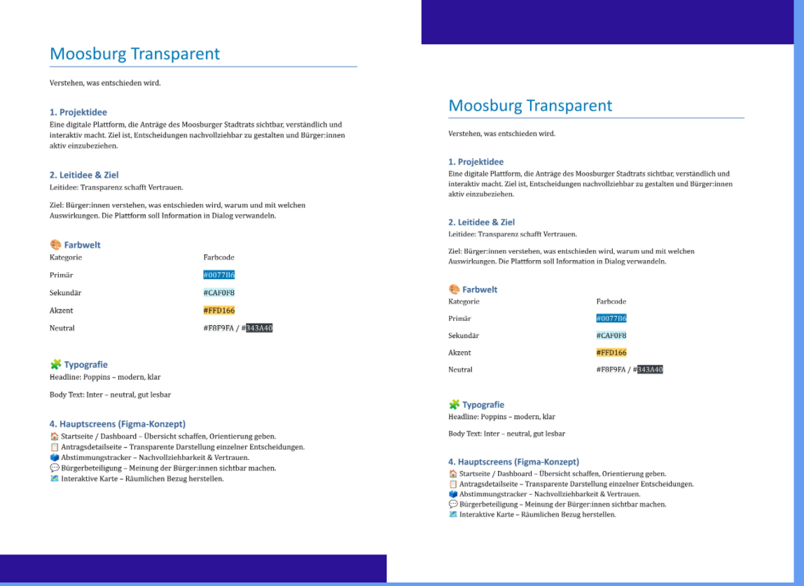

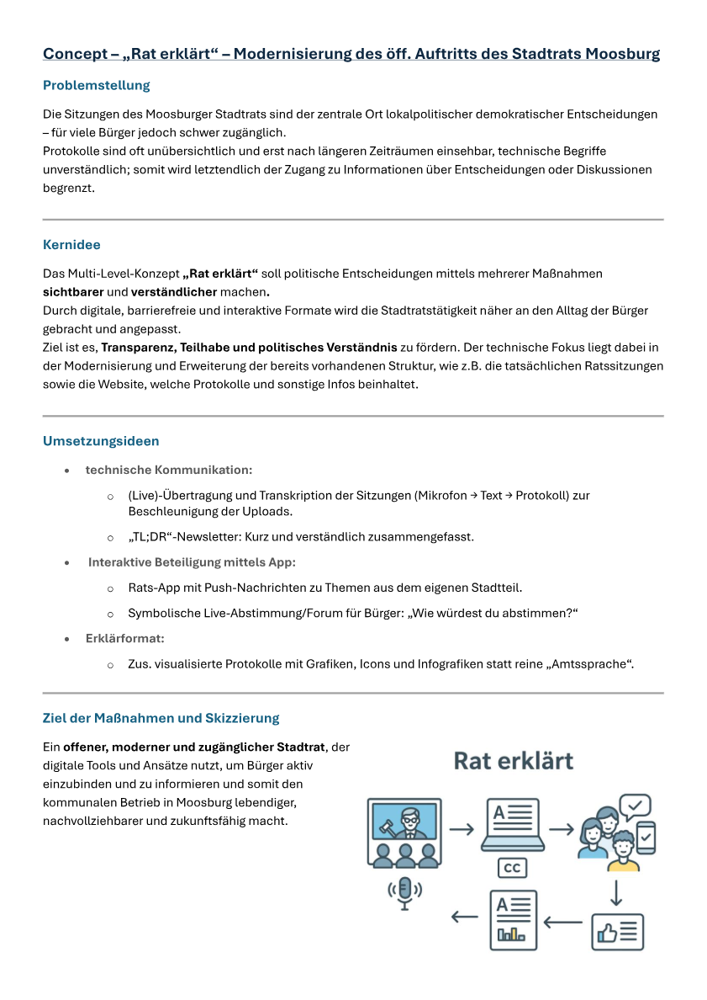